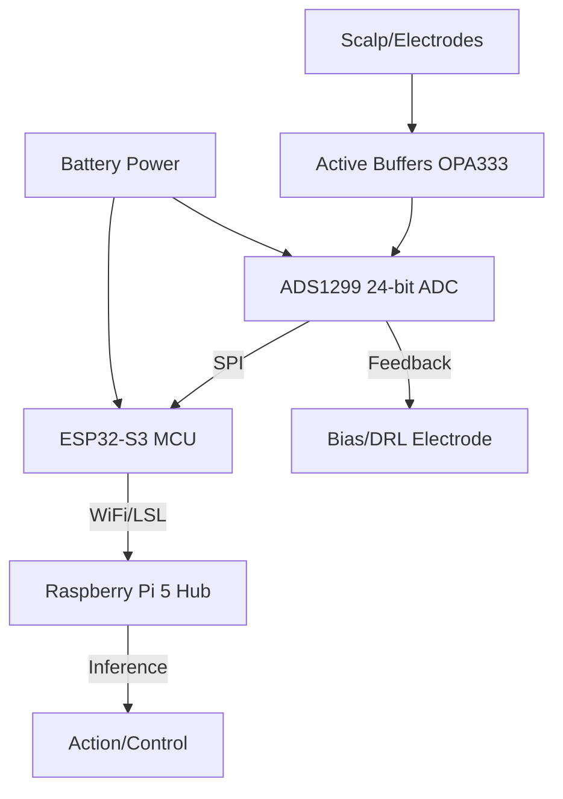

# Cerebrum-V1: Custom Headset Build Plan

## 1. Electronic Architecture (The Acquisition Board)
The heart of the system is the **TI ADS1299** 24-bit ADC, interfaced with an **ESP32-S3** for wireless LSL streaming.

### Wiring Diagram (ESP32-S3 to ADS1299)
| ADS1299 Pin | ESP32-S3 Pin | Function |
| :--- | :--- | :--- |
| **DIN** | **GPIO 11** | MOSI |
| **DOUT** | **GPIO 13** | MISO |
| **SCLK** | **GPIO 12** | SPI Clock |
| **CS** | **GPIO 10** | Chip Select |
| **DRDY** | **GPIO 9** | Data Ready (Interrupt) |
| **START** | **GPIO 14** | Sync/Start |
| **RESET** | **GPIO 21** | Hardware Reset |
| **DVDD** | **3.3V** | Digital Power |
| **AVDD** | **3.3V** | Analog Power (Single Supply) |
| **DGND/AVSS**| **GND** | Common Ground |

## 2. Active Dry Electrode Circuit
To bypass hair impedance and eliminate 50/60Hz noise at the source.

### Component Logic (Per Channel)
*   **Buffer:** **OPA333** (Ultra-low offset, zero-drift op-amp).
*   **Input Protection:** 10kΩ series resistor + BAV199 low-leakage ESD diodes.
*   **Biasing:** 100MΩ resistor from Input to Vref (1.65V) to prevent floating inputs.
*   **Shielding:** Output of the OPA333 drives the cable shield (Active Shielding) to nullify parasitic capacitance.

## 3. Driven Right Leg (DRL) / Bias Circuit
*   **Function:** Sums common-mode noise from all active electrodes, inverts it, and drives it back via a "Bias" electrode to the scalp.
*   **Hardware:** Uses the ADS1299 internal BIAS_AMP or an external TLV2211.

## 4. Mechanical Design (The "Spider" Frame)
*   **Standard:** 10-20 International System.
*   **Design:** 3D-printable lattice (PLA/PETG) with TPU flexible ribs.
*   **Electrode Sockets:** M12 threaded inserts for "Screw-in" active electrodes, allowing for individual pressure adjustment.

## 6. Bill of Materials (BOM)
To ensure research-grade results, we recommend the following components:

| Item | Specification | Approx. Cost |
| :--- | :--- | :--- |
| **ADC IC** | TI ADS1299IPAG (64-TQFP) | $75.00 |
| **MCU** | ESP32-S3-WROOM-1-N16R8 | $7.00 |
| **Op-Amps** | OPA333 (for active electrodes, 8x) | $12.00 |
| **LDO** | LT1763 (Ultra-low noise, 3.3V) | $5.00 |
| **PCB** | Custom 2-layer FR4 | $25.00 |
| **Electrodes** | Gold-plated spring pins (Pogo pins) | $10.00 |
| **Battery** | 3.7V 1200mAh LiPo | $10.00 |
| **Total** | | **~$144.00** |

## 7. Safety & Isolation Protocols
